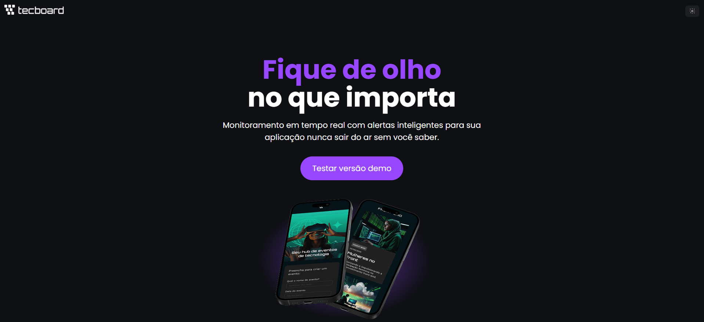
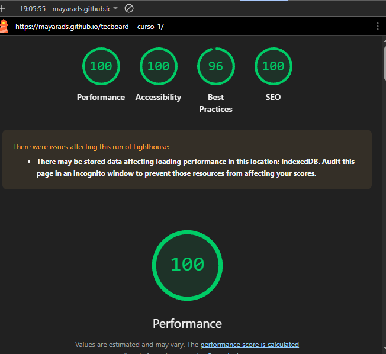

# TecBoard - Painel de Monitoramento Interativo 🚀

O **TecBoard** é um painel dinâmico projetado para monitoramento em tempo real com alertas inteligentes. O projeto foi desenvolvido para consolidar os fundamentos do desenvolvimento Front-end modernos e a manipulação avançada do DOM (Document Object Model) utilizando JavaScript puro.

🌐 **Acesse o projeto na prática:** [TecBoard no GitHub Pages](https://mayarads.github.io/tecboard---curso-1/)

---

## 📱 Preview da Aplicação

<p align="center">
  
</p>

---

## 📊 Performance e Qualidade Técnica (Google Lighthouse)

A aplicação foi submetida à auditoria oficial do Google Lighthouse, alcançando métricas excelentes que comprovam a qualidade, velocidade e otimização do código:

<p align="center">
  
</p>

* **Performance:** 100/100 ⚡
* **Acessibilidade:** 100/100 ♿
* **SEO:** 100/100 🔍
* **Melhores Práticas:** 96/100 🛠️

---

## 🎯 Problema que o projeto resolve

Muitas interfaces de monitoramento pecam por carregar scripts pesados ou frameworks complexos para interações que deveriam ser leves e instantâneas. O **TecBoard** resolve o desafio de entregar um dashboard de monitoramento fluido, responsivo e de altíssima performance, garantindo atualizações dinâmicas na tela utilizando apenas os recursos nativos do ecossistema Web tradicional.

## 🛠️ Tecnologias Utilizadas

* **HTML5:** Estruturação semântica, garantindo nota máxima em acessibilidade e SEO.
* **CSS3:** Estilização moderna (Dark Mode), layouts adaptáveis e design minimalista focado em experiência do usuário (UX).
* **JavaScript Vanilla:** Lógica de programação nativa, gerenciamento de eventos e manipulação dinâmica dos elementos do DOM.
* **Git & GitHub:** Versionamento de código e boas práticas de gerenciamento de branch (`main`).
* **GitHub Pages:** Hospedagem e deploy contínuo da aplicação.

## ✨ Principais Diferenciais

* **Manipulação Ativa do DOM:** Alteração e renderização de dados em tempo real sem a necessidade de recarregar a página.
* **Otimização Extrema:** Arquitetura leve construída para atingir carregamento instantâneo.
* **Design Responsivo:** Interface que se adapta perfeitamente a dispositivos móveis e desktops, mantendo a clareza visual dos dados.

## 📦 Como rodar o projeto localmente

1. Clone este repositório para a sua máquina:
   ```bash
   git clone [https://github.com/mayarads/tecboard---curso-1.git](https://github.com/mayarads/tecboard---curso-1.git)
